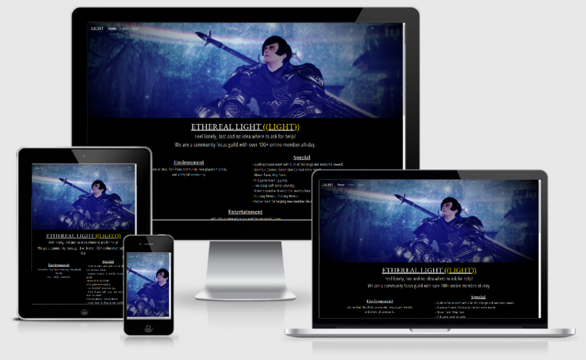
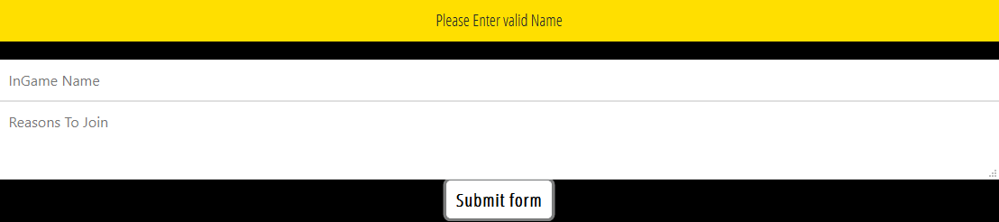
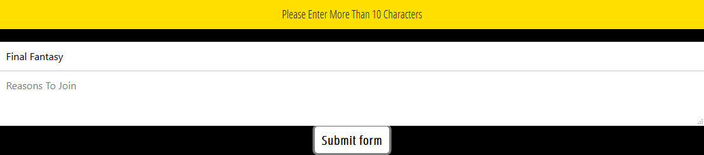
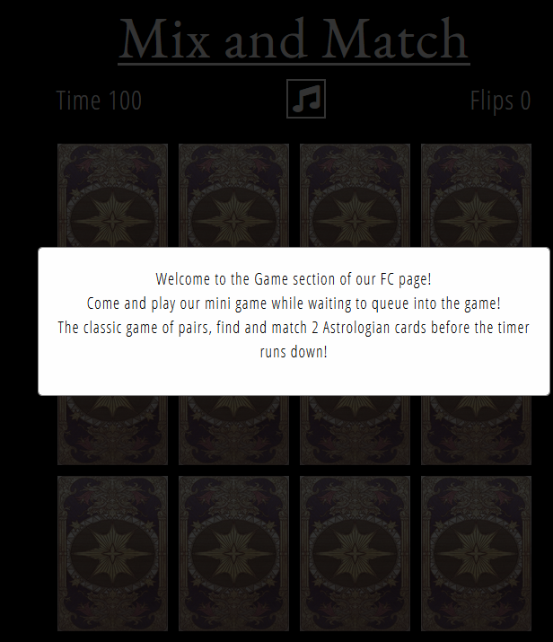
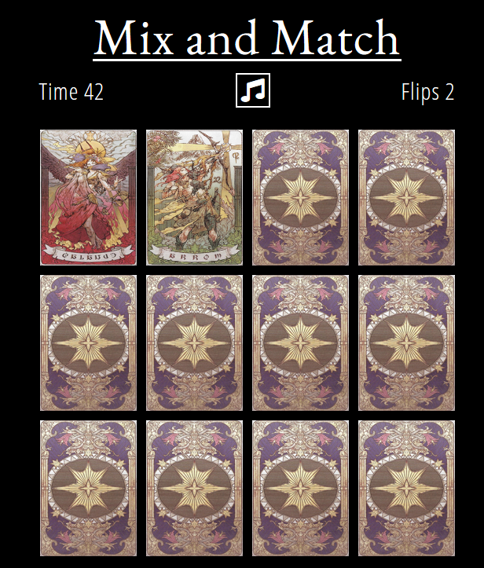
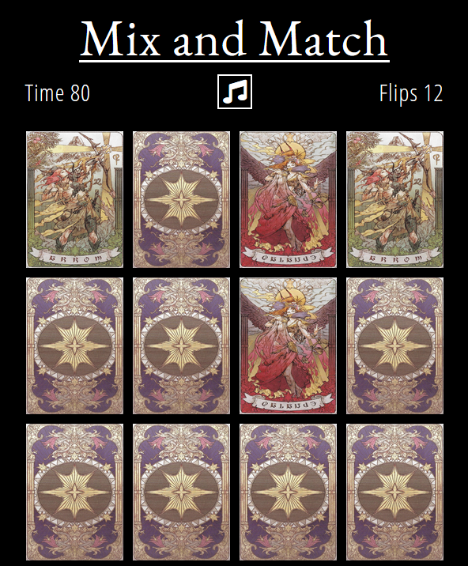
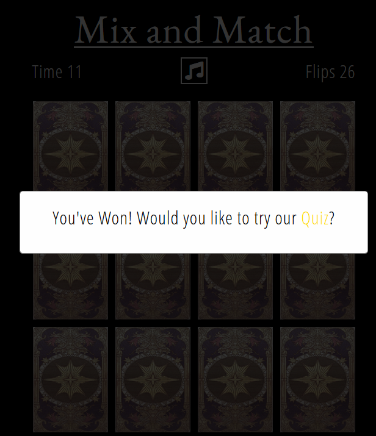
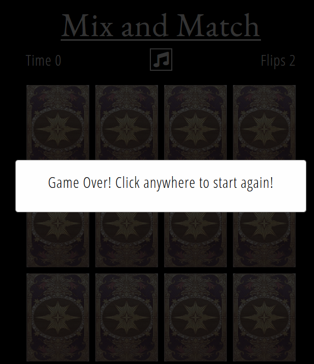
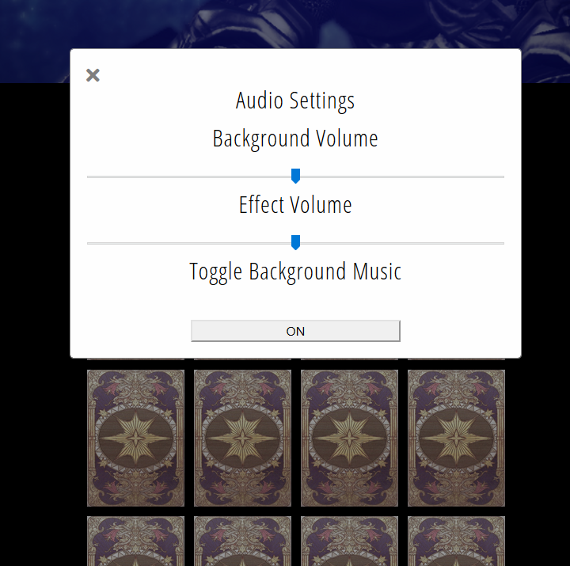

# [The Ethereal Light](url)
 

This is a website for the super popular MMORPG (Massive multiplayer online role playing game), Final Fantasy XIV. Players of all skill levels can join our helpful and friendly Free Company. 
A Free Company is essentially a guild where players can come together and tackle all sorts of activities, be it beginner or expert levels of difficulty.
The site will help players with joining our Free Company by submitting a form where there is also a card matching game and a quiz to play!

- ## User Stories
   - ### Visitor 
     As a visitor and user of the site, I wish to:
      1. Find out what the FC can provide.
      2. Get to know the environment of this FC and if it is right for me.
      3. Send an application to join the FC.
      4. Play a game while waiting during in-game queues.
      5. Test my Final Fantasy XIV knowledge.
- ## Design
   - ### Color Theme
      The two main colours used are Black for the background and White for the font. The "LIGHT" word is yellow as to highlight it.
   - ### Font
      1. EB Garamond as the main heading choices.
      2. Playfair Display as the second heading.
      3. Open Sans Condensed as the normal font.
      4. Sans Serif will be the fall back font if all fonts don't work.
   - ### Wireframe
      1. *[Desktop and Mobile Wireframe](./assets/readme/wireframe.pdf) need to upload wireframe*
      2. Tablet is the same as Desktop version.

- ## Technologies Used
   - ### Languages
      1. [HTML](https://en.wikipedia.org/wiki/HTML)
      2. [CSS](https://en.wikipedia.org/wiki/CSS)
      3. [Javascript](https://en.wikipedia.org/wiki/JavaScript)

   - ### Frameworks, Libraries & Programs Used
      1. [Bootstrap v4.5.2](https://getbootstrap.com/) (Responsiveness and styling of the website.)
      2. [Google Fonts](https://fonts.google.com/)  (Used to obtain my fonts.)
      3. [Font Awesome v5.14.0](https://fontawesome.com/) (Used on all pages to add icon for aesthetic and UX purposes.)
      4. [GitPod](https://www.gitpod.io/) (Used terminal to git commit and git push to GitHub. Also used for version control.)
      5. [GitHub](https://github.com/) (Store projects after being pushed from Gitpod.)
      6. [Balsamiq](https://balsamiq.com/) (Used to design the layout of the website.)
      7. [PicResize](https://picresize.com/) (Used for resizing images that are too large.)
      8. [YTMP3](https://ytmp3.cc/en13/) (Used to convert Youtube music to mp3 file.)

- ## Audio sites
   1. [YouTube](https://www.youtube.com/) 
   2. [FFXIV Fan Kit](https://na.finalfantasyxiv.com/lodestone/special/fankit/smartphone_ringtone/)

- ## Testing
  ### Testing - Form Submission
    Testing was performed for the Form Submission to ensure that the form is filled out correctly and without empty fields.
     - An error message appears where there is an empty entry in "InGame Name" field. 
     
    - An error message appears where there is less than 10 characters in the "Reasons To Join" field.
     
  ### Matching Game Card
     - The timer starts at 100 and decreases by 1 each second. Each time a card is flipped, the flip counter increases by 1 per flip.
     - When first entering the Card Matching page, there is a popup to describe how to play the game. Clicking 
        anywhere on the screen will remove this popup and the game will start, as well with the music.
    
     - Where there is a mismatch of cards, the cards will automatically be turned facing down.
    
     - Where there are correctly paired cards, they will stay facing up.
    
     - (Victory Overlay) When all cards are correctly paired, the user is asked if they would like to try the quiz.
    
     - (Overlay Game Over) When the timer reaches zero, the Game Over overlay appears. When the user clicks 
     anywhere on the screen, the game will restart with the Time back at 100 and Flips back to 0.
    

    Audio Control
    
     - The volume sliders for the Background music and sound effects are working correctly. Toggling the 
     background music on or off also works as intended.

- ## Deployment

- ## Tutorials and Credits
   - ### Code
      1. [Bootstrap](https://getbootstrap.com/) For majority of the page like row and column, carousel, video and navbar.
      2. [Nav center](https://www.codeply.com/go/qhaBrcWp3v) To center the navigation bar on Desktop and Tablet display.
      3. [Youtube - 'Web Dev Simplified'](https://www.youtube.com/watch?v=28VfzEiJgy4&t=6s&ab_channel=WebDevSimplified) Card Matching Game
      4. [Youtube - 'Web Dev Simplified'](https://www.youtube.com/watch?v=riDzcEQbX6k&t=1048s&ab_channel=WebDevSimplified) Quiz
      5. [Youtube - 'Coding Market'](https://www.youtube.com/watch?v=WY4rvU4ImgE&ab_channel=CodingMarket) Form
      6. [stackoverflow](https://stackoverflow.com/questions/62160275/js-audio-volume-slider) Volume Slider
   - ### Content
      [Quiz](http://www.quiz.co.uk/index.php/quiz-categories/sports-games/180-final-fantasy-xiv-quiz) For the quiz question.
   - ### Media
      [Fandom](https://finalfantasy.fandom.com/wiki/Astrologian_(Final_Fantasy_XIV)) For the astrologian card matching game image.
      The images and in-game screenshots were taken and edited by myself.

- ## Acknowledgements
