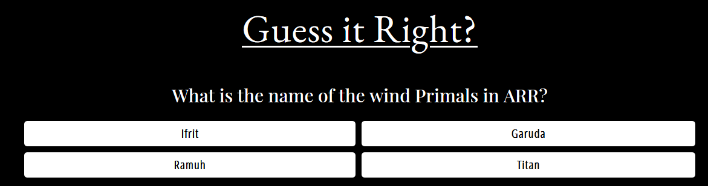
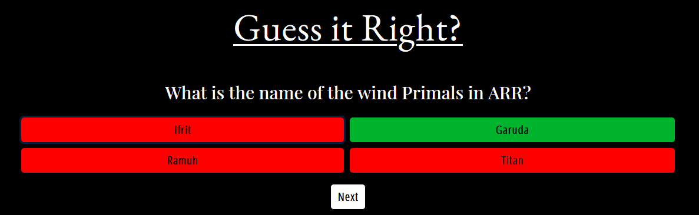

# [The Ethereal Light](url)
 

This is a website for the super popular MMORPG (Massive multiplayer online role playing game), Final Fantasy XIV. Players of all skill levels can join our helpful and friendly Free Company. 
A Free Company is essentially a guild where players can come together and tackle all sorts of activities, be it beginner or expert levels of difficulty.
The site will help players with joining our Free Company by submitting a form where there is also a card matching game and a quiz to play!

- ## User Stories
   - ### Visitor 
     As a visitor and user of the site, I wish to:
      1. Find out what the FC can provide.
      2. Get to know the environment of this FC and if it is right for me.
      3. Send an application to join the FC.
      4. Play a game while waiting during in-game queues.
      5. Test my Final Fantasy XIV knowledge.
- ## Design
   - ### Color Theme
      The two main colours used are Black for the background and White for the font. The "LIGHT" word is yellow as to highlight it.
   - ### Font
      1. EB Garamond as the main heading choices.
      2. Playfair Display as the second heading.
      3. Open Sans Condensed as the normal font.
      4. Sans Serif will be the fall back font if all fonts don't work.
   - ### Wireframe
      1. [Desktop and Mobile Wireframe](./assets/readme/ethereal_light.pdf)
      2. Tablet is the same as Desktop version.

- ## Features and Functionality
   - ### Submission Form
       The submission form is used for the application to join the Free Company.
       The user will have to submit their InGame Name and their reason to join.
       The form may not be submitted if the InGame Name is blank and if there are less than 10 characters in the Reason to Join fields.
       This form is linked to my own email where I will be notified of an application.

   - ### Card Game
       This game will is a basic pair matching game. 
       There are a total of 12 cards, 6 unique Astrologian cards.
       The player has 100 seconds to match all 6 pairs.
       There is a "Flip" counter to show how many times a player has flipped a card.
       When the player has successfully matched all cards, an overlay will appear as well as a victory sound to let the player know.
       If the time limit reaches zero, an overlay will appear to show that the player has failed the game.
       Each of these overlays have the ability to replay the game when they click anywhere on the screen.
       There is background music that starts to play when the user clicks "start".
       A modal for Audio Settings is available to adjust the volume of both music and sound effects. The music can also be turned off completely.

   - ### Quiz
       There are a total of 4 questions related to Final Fantasy XIV.
       Each question is a multiple choice with 4 choices.
       When the player has clicked their answer, all the wrong answers will be in red and the correct answer will be in green.
       Once the final question is answered, there is a replay button to start the quiz from the beginning.

- ## Technologies Used
   - ### Languages
      1. [HTML](https://en.wikipedia.org/wiki/HTML)
      2. [CSS](https://en.wikipedia.org/wiki/CSS)
      3. [Javascript](https://en.wikipedia.org/wiki/JavaScript)

   - ### Frameworks, Libraries & Programs Used
      1. [Bootstrap v4.5.2](https://getbootstrap.com/) (Responsiveness and styling of the website.)
      2. [Google Fonts](https://fonts.google.com/)  (Used to obtain my fonts.)
      3. [Font Awesome v5.14.0](https://fontawesome.com/) (Used on all pages to add icon for aesthetic and UX purposes.)
      4. [GitPod](https://www.gitpod.io/) (Used terminal to git commit and git push to GitHub. Also used for version control.)
      5. [GitHub](https://github.com/) (Store projects after being pushed from Gitpod.)
      6. [Balsamiq](https://balsamiq.com/) (Used to design the layout of the website.)
      7. [PicResize](https://picresize.com/) (Used for resizing images that are too large.)
      8. [YTMP3](https://ytmp3.cc/en13/) (Used to convert Youtube music to mp3 file.)

- ## Audio sites
   1. [YouTube](https://www.youtube.com/) 
   2. [FFXIV Fan Kit](https://na.finalfantasyxiv.com/lodestone/special/fankit/smartphone_ringtone/)

- ## Testing
     1. Tested HTML code via [W3C Markup Validator](https://validator.w3.org/) and results show 1 warning where "The type attribute is unnecessary for JavaScript resources." was not necessary, I decided to keep this in as per the resource code.
     2. Tested CSS via [W3C CSS Validator Services](https://jigsaw.w3.org/css-validator/) and results show 1 warning about imported style sheets are not checked in direct input and file upload modes but it's not affecting the site. 
     3. Tested Javascript via [JSHint](https://jshint.com/) there were no issue found.

  ### Testing - Form Submission
    Testing was performed for the Form Submission to ensure that the form is filled out correctly and without empty fields.
     - An error message appears where there is an empty entry in "InGame Name" field. 
     
    - An error message appears where there is less than 10 characters in the "Reasons To Join" field.
     
  ### Matching Game Card
     - The timer starts at 100 and decreases by 1 each second. Each time a card is flipped, the flip counter increases by 1 per flip.
     - When first entering the Card Matching page, there is a popup to describe how to play the game. Clicking 
        anywhere on the screen will remove this popup and the game will start, as well with the music.
    
     - Where there is a mismatch of cards, the cards will automatically be turned facing down.
    
     - Where there are correctly paired cards, they will stay facing up.
    
     - (Victory Overlay) When all cards are correctly paired, the user is asked if they would like to try the quiz.
    
     - (Overlay Game Over) When the timer reaches zero, the Game Over overlay appears. When the user clicks 
     anywhere on the screen, the game will restart with the Time back at 100 and Flips back to 0.
    

    Audio Control
    
     - The volume sliders for the Background music and sound effects are working correctly. Toggling the 
     background music on or off also works as intended.
  ### Matching Game Card
     - Clicking start will start the quiz.
     
     - when a player clicks an answer, the correct and wrong answers will be shown where green is 
     correct and red is incorrect.
     
     
     - Clicking "Next" will move onto the next question.

  ### As a visitor and user of the site, I wish to:
    Find out what the FC can provide.
     - The user can read all about the Free Company on the home page where it details activities such as 
     Guild exclusive events/challenges, Glamour contests, game content farming and much more. It also 
     mentions that the FC is friendly and helpful to all players.

    Get to know the environment of this FC and if it is right for me.
     - The user can see that the environment is an active, talkative and helpful group of players, 
     particularly towards new players.

    Send an application to join the FC.
     - The home page has a section called "How to apply?" where the user can submit their in-game name and 
     their reasons to join the Free Company.

    Play a game while waiting during in-game queues.
     - There are 2 games available on the site. A Card Matching game and a quiz.

    Test my Final Fantasy XIV knowledge.
     - The quiz will ask the player questions all about Final Fantasy XIV such as character classes, game 
     content and more.

- ## Deployment
   - ### The project was deployed to GitHub Pages using the following steps.

      1. Log into GitHub and locate the [GitHub Repository](https://github.com/Tanyapond/Geoskincare-Malaysia)
      2. At the top of the page, locate the "Settings" button beside "Insights" button on the menu.
      3. Scroll to the bottom until you notice the "GitHub Pages" section.
      4. Under the "Source" dropdown button, choose "Master Branch".
      5. Make sure the /roots folder is chosen too then click save and the page will automatically refresh.
      6. Scroll back to the bottom of the page and locate the now published website on the "GitHub Pages" section.

- ## Tutorials and Credits
   - ### Code
      1. [Bootstrap](https://getbootstrap.com/) For majority of the page like row and column, carousel, video and navbar.
      2. [Nav center](https://www.codeply.com/go/qhaBrcWp3v) To center the navigation bar on Desktop and Tablet display.
      3. [Youtube - 'Web Dev Simplified'](https://www.youtube.com/watch?v=28VfzEiJgy4&t=6s&ab_channel=WebDevSimplified) Card Matching Game
      4. [Youtube - 'Web Dev Simplified'](https://www.youtube.com/watch?v=riDzcEQbX6k&t=1048s&ab_channel=WebDevSimplified) Quiz
      5. [Youtube - 'Coding Market'](https://www.youtube.com/watch?v=WY4rvU4ImgE&ab_channel=CodingMarket) Form
      6. [stackoverflow](https://stackoverflow.com/questions/62160275/js-audio-volume-slider) Volume Slider
   - ### Content
      [Quiz](http://www.quiz.co.uk/index.php/quiz-categories/sports-games/180-final-fantasy-xiv-quiz) For the quiz question.
   - ### Media
      [Fandom](https://finalfantasy.fandom.com/wiki/Astrologian_(Final_Fantasy_XIV)) For the astrologian card matching game image.
      The images and in-game screenshots were taken and edited by myself.

- ## Acknowledgements
